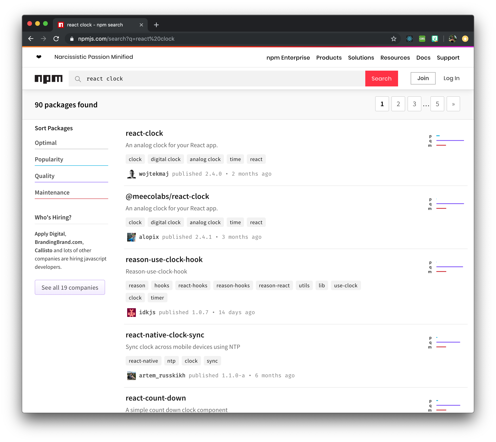
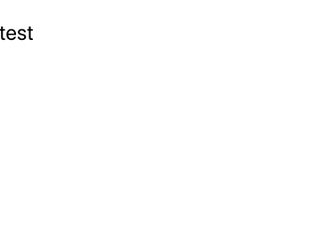
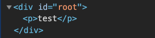
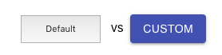
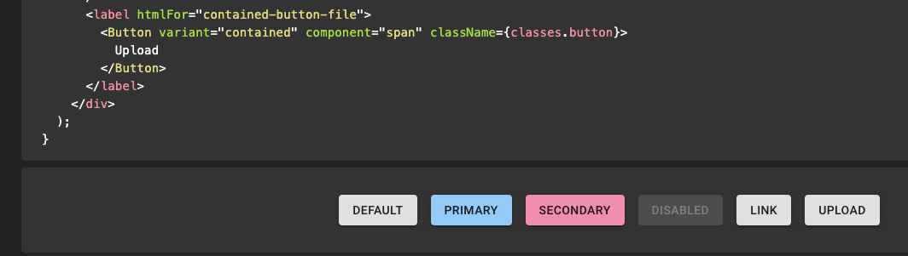
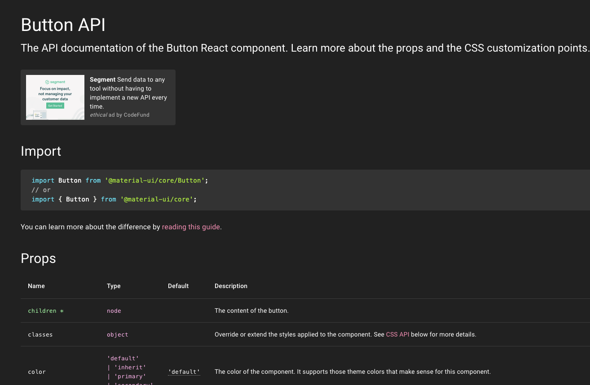
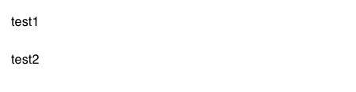
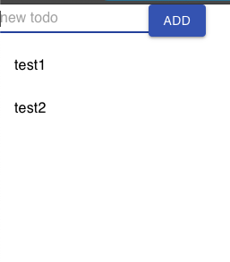
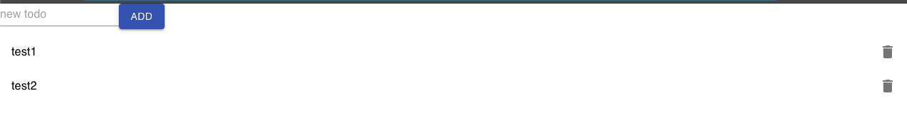
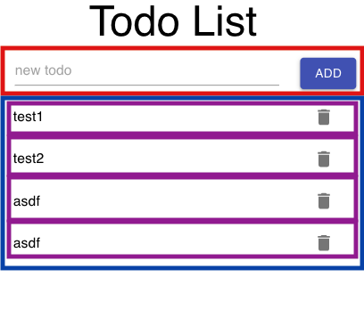

import { Head, Appear, Code, Notes, Image } from 'mdx-deck'
import { Invert, Split , SplitRight } from 'mdx-deck/layouts'
import { CodeSurfer, components } from 'mdx-deck-code-surfer'
import { default as mdxTheme } from 'mdx-deck/themes'
import nightOwl from 'prism-react-renderer/themes/nightOwl'
import AnalogClock from 'analog-clock-react'


export const theme = {
  ...mdxTheme,
  codeSurfer: {
    ...nightOwl,
    showNumbers: true
  }
}
export { components } from "mdx-deck-code-surfer"

<Head>
  <title>iCIMS - Building Front-End Applications, Rapidly</title>
</Head>

export default Invert

# Building Front-End Applications, Rapidly
## Parish & Carlos
## iCIMS Labs

---


---

export default Split

<div>
  <h2>Parish Regn-Stillwaggon</h2>
  
</div>

<div>
  <h2>Carlos Limardo</h2>
  
</div>

---

## Agenda

- What is React
- Intro to JSX
- Hands on, create a simple component
- 3rd Party Components
- Hands on, create-react-app 
- Hands on, using a 3rd party component (Material UI)

<small>Prerecquisits: Javascript, HTML, CSS &amp; Node.js</small>
---

## Objectives and Expectations

- Upon completing this workshop, you will:
  - Have an understanding of React
  - How to create simple React components
  - How to use 3rd party React components
  - Build a simple ToDo app using `create-react-app`

---

export default Invert

## ReactJS

---

## What is React?

- A Javascript library for building user interfaces
- The V in M**V**C
- VirtualDOM
- Component based (components on components on components!)
- Key terms: Components, Props, State

---

## JSX

- Javascript + XML
- Extension of ES6
- HTML with some modifications
  - `className` instead of `class`
  - `children` prop
- Easier to read &amp; write

---
```javascript Using Javascript
function Hello(props) {
  return React.createElement(
    'div',
    { style: { fontSize: '20px' }, className: 'wrapper' },
    `Hello ${props.toWho}!`
  );
}

ReactDOM.render(
  React.createElement(Hello, {toWho: 'World'}, null),
  document.getElementById('root')
);

----
1:7 > 
2[3:5] > React.createElement(elements||Component, props, ...children);
3 > Using a 'div' element
4 > Props (inline style and a className)
5 > Children (whats's inside of your HTML tag)
5[3:5] > Using the toWho from prop argument
9:12 > <div class="wrapper" style="font-size: 20px">Hello World</div>
```

---
```javascript With JSX
function Hello(props) {
  return (
    <div
      className="wrapper"
      style={{fontSize: '20px'}}
    >
      Hello {props.toWho}!
    </div>
  );
}

ReactDOM.render(
  <Hello toWho="World" />,
  document.getElementById('root')
);
----
* > 
2:9 > Familiar, looks just like HTML
3 > element
4:5 > Props
7 > Child or Children
7[3:7] > Using the toWho value of the components props
13 > Easier to use and define props, children, etc.
12:15 > <div class="wrapper" style="font-size: 20px">Hello World</div>
```
---

## Reusing Components



---
export default Split

`<AnalogClock />`

<AnalogClock />

---

export default Invert

# Let's build a todo list!

---

# Let's build a todo list!

1. Create a react project
2. Adding a basic list
3. Add state and controls
4. Make our todo list responsive
5. Ways to take your app further

---

# create-react-app

- Written by facebook for learning react
- Generates a full react project with a single command
-   Serious time saver
  - Lots of tooling is configured for you
  - Hot-reloading dev server

---

  # Generating a project

  `npx create-react-app rapid-react-todo`

- Open in VS Code
- Open terminal (ctrl + `)
- Execute the dev server with `npm start`

---
# The app will look like this

---
# The project structure will look like this


open app.js
---

```javascript src/App.js
import React from 'react';
import logo from './logo.svg';
import './App.css';

function App() {
  return (
    <div className="App">
      <header className="App-header">
        
        <p>
          Edit <code>src/App.js</code> and save to reload.
        </p>
        <a
          className="App-link"
          href="https://reactjs.org"
          target="_blank"
          rel="noopener noreferrer"
        >
          Learn React
        </a>
      </header>
    </div>
  );
}

export default App;
----
* > Lets clean out the app so we can write our todo list code here
2:3 > Remove lines 2-3
```

---

```javascript
import React from 'react';

function App() {
  return (
    <div className="App">
      <header className="App-header">
        
        <p>
          Edit <code>src/App.js</code> and save to reload.
        </p>
        <a
          className="App-link"
          href="https://reactjs.org"
          target="_blank"
          rel="noopener noreferrer"
        >
          Learn React
        </a>
      </header>
    </div>
  );
}

export default App;
----
* > Remove lines 2-3
5:20 > Replace line 5-20 with <><p>test</p><>
```
---

```javascript
import React from 'react';

function App() {
  return (
    <>
      <p>test</p>
    </>
  );
}

export default App;
----
* > Your code will look like this
1 > Always import react when using jsx
3 > Prefer stateless functional components over class components
5,7 > An empty tag is a "fragment" a container component that renders nothing to the DOM
6 > We'll render this just to know our app is working
```
---
export default Invert

# Your app will look like this



---

# How your app looks in HTML



All of your app renders into the "root" element

---

# Component Libraries

- Default HTML Elements look bad
  
- Great looking components
- Features HTML doesn't have
- Components HTML doesn't have

---

# Material UI

- Check out [Material UI](https://material-ui.com/)
- React component library based on [Material Design](https://material.io/design/)
- Install Material UI Core Components and Icons
  - `npm install @material-ui/core`
  - `npm install @material-ui/icons`

---

# Material Components for Todo List

- List, ListItem, etc (<a href="https://material-ui.com/components/lists/" target="_blank">Examples</a> | <a href="https://material-ui.com/components/lists/#api" target="_blank">Docs</a>)
- Button, IconButton (<a href="https://material-ui.com/components/buttons/" target="_blank">Examples</a> | <a href="https://material-ui.com/components/buttons/#api" target="_blank">Docs</a>)
- TextField (<a href="https://material-ui.com/components/text-fields/" target="_blank">Examples</a> | <a href="https://material-ui.com/components/text-fields/#api" target="_blank">Docs</a>)
- DeleteIcon (<a href="https://material-ui.com/components/icons/" target="_blank">Examples</a> | <a href="https://material-ui.com/components/icons/#api" target="_blank">Docs</a>)
- Grid (<a href="https://material-ui.com/components/grid/" target="_blank">Examples</a> | <a href="https://material-ui.com/components/grid/#api" target="_blank">Docs</a>)

---

# Component Example Pages

- Lots of examples of components
- Live editing of all examples



---

# Component API Pages



---

```javascript
import React from 'react';
import { List, ListItem, ListItemText } from '@material-ui/core';

function App() {
  return (
    <>
      <p>test</p>
    </>
  );
}

export default App;
----
* > Let's start by adding some todos to our page
2 > Import List, ListItem, and ListItemText from material-ui
7 > Replace our placeholder test code with a List of todos
```

---

```javascript
import React from 'react';
import { List, ListItem, ListItemText } from '@material-ui/core';

function App() {
  return (
    <>
      <List>
        <ListItem>
          <ListItemText>Todo1</ListItemText>
        </ListItem>
        <ListItem>
          <ListItemText>Todo2</ListItemText>
        </ListItem>
      </List>
    </>
  );
}

export default App;
----
7:14 > We've added a static list with 2 todo items
7:14 > This is good but we need a way to render todos from data...
```
---
export default Invert

# Your app with list items



---

# About React Hooks and State

- React Hooks are functions that hook extra behavior into our components
- The <a href="https://reactjs.org/docs/hooks-state.html" target="_blank">useState</a> hook lets our component remember things between renders
- Let's add state to our todo list

---

```javascript
import React, { useState } from 'react';
import { List, ListItem, ListItemText } from '@material-ui/core';

function App() {
  const [todos, setTodos] = useState(['test1', 'test2']);

  return (
    <>
      <List>
        {todos.map((todo, index) => (
          <ListItem key={index}>
            <ListItemText>{todo}</ListItemText>
          </ListItem>
        ))}
      </List>
    </ListItemText>
  );
}

export default App;
----
1 > We need to import "useState" from react like this
5 > This line adds state to our component
5[4] > "todos" is our state, an array of todo items, stored as strings
5[6] > "setTodos" is a function to set the state to a new value
7[13:18] > "['test1', 'test2']" is the initial value of the todos state
10:14 > We'll loop through all the todos in our state and render a ListItem for each one
10 > .map is used to convert each item in the todo state to a react element
```

---

# Adding new todos

- Our todos are part of state but our users can't manipulate them
- Lets add controls for adding new todos to our state
- A React "Ref" is used to access the HTML element rendered by react, we use this to read the value a user enters into a text field

---

```javascript
import React, { useState, useRef } from 'react';
import {
  Button,
  List,
  ListItem,
  ListItemText,
  TextField
} from '@material-ui/core';

function App() {
  const textFieldRef = useRef(null);
  const [todos, setTodos] = useState(['test1', 'test2']);

  // add new todo to state and clear the input
  function handleAddClick() {
    const newTodo = textFieldRef.current.value;
    if(newTodo.length > 0) {
      setTodos([...todos, newTodo]);
      textFieldRef.current.value = '';
    }
  };

  return (
    <>
      <TextField inputRef={textFieldRef} placeholder="new todo" />
      <Button variant="contained" color="primary" onClick={handleAddClick}>Add</Button>
      <List>
        {todos.map((todo, index) => (
          <ListItem key={index}>
            <ListItemText>{todo}</ListItemText>
          </ListItem>
        ))}
      </List>
    </>
  );
}

export default App;
----
1 > Import useRef from react
3,7 > Import TextField and Button from material-ui
11 > create a ref with useRef. We'll use the ref to get the value of the TextField
14:21 > Create a function to be called when the add button is clicked
16[4:8] > TextFieldRef.current.value will get the current value of our text field
17 > We don't actually update the state if there's no text in the text field
18 > Use "setTodos" to set the todo state. We create a new array that includes the new todo
19 > Clear the text field of its current value
25:26 > Finally we add our TextField and Button
25[3:7] > Setting the inputRef to textFieldRef allows us to access the text field value
25[8:10] > Placeholder text is displayed when our text field is empty
26[3:8] > Setting "variant" and "color" make the button appear solid
26[9:13] > Here we make sure the handleAddClick function is executed when our button is clicked
```

---
export default Invert

# Your app with add controls



---
# Removing todos

- Lets add a trash button for removing todos 
- Being able to remove todos is useful for marking things completed

---

```javascript
import React, { useState, useRef } from 'react';
import {
  Button,
  IconButton,
  List,
  ListItem,
  ListItemText,
  ListItemSecondaryAction,
  TextField
} from '@material-ui/core';
import { Delete as DeleteIcon } from '@material-ui/icons';

function App() {
  const textFieldRef = useRef(null);
  const [todos, setTodos] = useState(['test1', 'test2']);

  // add new todo to state and clear the input
  function handleAddClick() {
    const newTodo = textFieldRef.current.value;
    if(newTodo.length > 0) {
      setTodos([...todos, newTodo]);
      textFieldRef.current.value = '';
    }
  };

  // update state with deleted todo filtered out
  function handleDeleteClick(index) {
    setTodos(oldTodos => oldTodos.filter((e, i) => i !== index));
  }

  return (
    <>
      <TextField inputRef={textFieldRef} placeholder="new todo" />
      <Button variant="contained" color="primary" onClick={handleAddClick}>Add</Button>
      <List>
        {todos.map((todo, index) => (
          <ListItem key={index}>
            <ListItemText>{todo}</ListItemText>
            <ListItemSecondaryAction>
              <IconButton onClick={() => handleDeleteClick(index)}>
                <DeleteIcon />
              </IconButton>
            </ListItemSecondaryAction>
          </ListItem>
        ))}
      </List>
    </>
  );
}

export default App;
----
4,8 > Import IconButton and ListItemSecondaryAction
11 > Import Delete from material UI icons. Using "as" we can rename this to DeleteIcon
26:29 > Create a function to remove todo when delete button is clicked
39:43 > Add a ListItemSecondaryAction using the IconButton
```

---

export default Invert

# Your app with remove controls


---

# Responsive Layout

- Let's add a responsive Layout
- We'll use Material-UIs Grid component to make things look much better

---

```javascript
import React, { useState, useRef } from 'react';
import {
  Button,
  Grid,
  IconButton,
  List,
  ListItem,
  ListItemText,
  ListItemSecondaryAction,
  TextField,
  Typography
} from '@material-ui/core';
import { Delete as DeleteIcon } from '@material-ui/icons';

function App() {
  const textFieldRef = useRef(null);
  const [todos, setTodos] = useState(['test1', 'test2']);

  // add new todo to state and clear the input
  function handleAddClick() {
    const newTodo = textFieldRef.current.value;
    if(newTodo.length > 0) {
      setTodos([...todos, newTodo]);
      textFieldRef.current.value = '';
    }
  };

  // update state with deleted todo filtered out
  function handleDeleteClick(index) {
    setTodos(oldTodos => oldTodos.filter((e, i) => i !== index));
  }

  return (
    <>
      <Grid container justify="center">
        <Grid item xs={6} md={2}>
          <Typography variant="h3" gutterBottom>Todo List</Typography>
        </Grid>
      </Grid>
      <Grid container justify="center" spacing={3}>
        <Grid item xs={9} md={5}>
          <TextField inputRef={textFieldRef} placeholder="new todo" fullWidth />
        </Grid>
        <Grid item xs={2} md={1}>
          <Button variant="contained" color="primary" onClick={handleAddClick}>Add</Button>
        </Grid>
      </Grid>
      <Grid container justify="center">
        <Grid item xs={12} md={6}>
          <List>
            {todos.map((todo, index) => (
              <ListItem key={index}>
                <ListItemText>{todo}</ListItemText>
                <ListItemSecondaryAction>
                  <IconButton onClick={() => handleDeleteClick(index)}>
                    <DeleteIcon />
                  </IconButton>
                </ListItemSecondaryAction>
              </ListItem>
            ))}
          </List>
        </Grid>
      </Grid>
    </>
  );
}

export default App;
----
4,11 > Import Grid and Typography
35:39 > Add a cenetered header
35 > Use a container grid to center all content in a grid
36 > Use an item grid for all grid content
36 > Set sizes at different breakpoints using xs and md
37 > Typography will create text elements in material ui style
40:41, 43:44, 46:47 > We want the textfield and button side by side so we'll put them in the same container grid
48:49, 62:63 > Wrap the List with a centered grid, xs={12} and md={6}
```
---
export default Invert

## Desktop


---
export default Invert

## Phone


---

export default Invert

## Break it down



---

```javascript
import React, { useState, useRef } from 'react';
import TextField from '@material-ui/core/TextField';
import Button from '@material-ui/core/Button';
import IconButton from '@material-ui/core/IconButton';
import DeleteIcon from '@material-ui/icons/Delete';
import Grid from '@material-ui/core/Grid';
import Typography from '@material-ui/core/Typography';
import List from '@material-ui/core/List';
import ListItem from '@material-ui/core/ListItem';
import ListItemText from '@material-ui/core/ListItemText';
import ListItemSecondaryAction from '@material-ui/core/ListItemSecondaryAction';

function App() {
  const textFieldRef = useRef(null);
  const [todos, setTodos] = useState(['test1', 'test2']);

  // add new todo to state and clear the input
  function handleAddClick() {
    const newTodo = textFieldRef.current.value;
    if(newTodo.length > 0) {
      setTodos([...todos, newTodo]);
      textFieldRef.current.value = '';
    }
  };

  // update state with deleted todo filtered out
  function handleDeleteClick(index) {
    setTodos(oldTodos => oldTodos.filter((e, i) => i !== index));
  }

  return (
    <>
      <Grid container justify="center">
        <Grid item xs={6} md={2}>
          <Typography variant="h3" gutterBottom>Todo List</Typography>
        </Grid>
      </Grid>
      <Grid container justify="center" spacing={3}>
        <Grid item xs={9} md={5}>
          <TextField inputRef={textFieldRef} placeholder="new todo" fullWidth />
        </Grid>
        <Grid item xs={2} md={1}>
          <Button variant="contained" color="primary" onClick={handleAddClick}>Add</Button>
        </Grid>
      </Grid>
      <Grid container justify="center">
        <Grid item xs={12} md={6}>
          <List>
            {todos.map((todo, index) => (
              <ListItem key={index}>
                <ListItemText primary={todo} />
                <ListItemSecondaryAction>
                  <IconButton onClick={() => handleDeleteClick(index)}>
                    <DeleteIcon />
                  </IconButton>
                </ListItemSecondaryAction>
              </ListItem>
            ))}
          </List>
        </Grid>
      </Grid>
    </>
  );
}
----
* > 
2,3,6 > Components we need for our new Form component
38:45 > What we need for our Form component
```

---

```javascript lib/Form.js
import React from 'react';
import TextField from '@material-ui/core/TextField';
import Button from '@material-ui/core/Button';
import Grid from '@material-ui/core/Grid';

export default function Form(props) {
  <Grid container justify="center" spacing={3}>
    <Grid item xs={9} md={5}>
      <TextField inputRef={props.inputRef} placeholder="new todo" fullWidth />
    </Grid>
    <Grid item xs={2} md={1}>
      <Button variant="contained" color="primary" onClick={props.onAddClick}>Add</Button>
    </Grid>
  </Grid>
}
----
* > 
1:4 > Notice we did not import useRef or useState hooks
6:15 > Form component
9[3:9],12[9:15] > Convert functions to props
```
---

```javascript
import React, { useState, useRef } from 'react';
// import TextField from '@material-ui/core/TextField';
// import Button from '@material-ui/core/Button';
import IconButton from '@material-ui/core/IconButton';
import DeleteIcon from '@material-ui/icons/Delete';
import Grid from '@material-ui/core/Grid';
import Typography from '@material-ui/core/Typography';
import List from '@material-ui/core/List';
import ListItem from '@material-ui/core/ListItem';
import ListItemText from '@material-ui/core/ListItemText';
import ListItemSecondaryAction from '@material-ui/core/ListItemSecondaryAction';

import Form from './lib/Form';

function App() {
  const textFieldRef = useRef(null);
  const [todos, setTodos] = useState(['test1', 'test2']);

  // add new todo to state and clear the input
  function handleAddClick() {
    const newTodo = textFieldRef.current.value;
    if(newTodo.length > 0) {
      setTodos([...todos, newTodo]);
      textFieldRef.current.value = '';
    }
  };

  // update state with deleted todo filtered out
  function handleDeleteClick(index) {
    setTodos(oldTodos => oldTodos.filter((e, i) => i !== index));
  }

  return (
    <>
      <Grid container justify="center">
        <Grid item xs={6} md={2}>
          <Typography variant="h3" gutterBottom>Todo List</Typography>
        </Grid>
      </Grid>
      <Form inputRef={textFieldRef} onAddClick={handleAddClick} />
      <Grid container justify="center">
        <Grid item xs={12} md={6}>
          <List>
            {todos.map((todo, index) => (
              <ListItem key={index}>
                <ListItemText primary={todo} />
                <ListItemSecondaryAction>
                  <IconButton onClick={() => handleDeleteClick(index)}>
                    <DeleteIcon />
                  </IconButton>
                </ListItemSecondaryAction>
              </ListItem>
            ))}
          </List>
        </Grid>
      </Grid>
    </>
  );
}
----
* > 
1:11 > Remove the Text and Button
13 > Import the new Form component
40 > Use our Form component
20:31 > Functionality still lives as far as possible outside
40[6,11] > Passed as Props
```
---

```javascript
import React, { useState, useRef } from 'react';
import IconButton from '@material-ui/core/IconButton';
import DeleteIcon from '@material-ui/icons/Delete';
import Grid from '@material-ui/core/Grid';
import Typography from '@material-ui/core/Typography';
import List from '@material-ui/core/List';
import ListItem from '@material-ui/core/ListItem';
import ListItemText from '@material-ui/core/ListItemText';
import ListItemSecondaryAction from '@material-ui/core/ListItemSecondaryAction';

import Form from './lib/Form';

function App() {
  const textFieldRef = useRef(null);
  const [todos, setTodos] = useState(['test1', 'test2']);

  // add new todo to state and clear the input
  function handleAddClick() {
    const newTodo = textFieldRef.current.value;
    if(newTodo.length > 0) {
      setTodos([...todos, newTodo]);
      textFieldRef.current.value = '';
    }
  };

  // update state with deleted todo filtered out
  function handleDeleteClick(index) {
    setTodos(oldTodos => oldTodos.filter((e, i) => i !== index));
  }

  return (
    <>
      <Grid container justify="center">
        <Grid item xs={6} md={2}>
          <Typography variant="h3" gutterBottom>Todo List</Typography>
        </Grid>
      </Grid>
      <Form inputRef={textFieldRef} onAddClick={handleAddClick} />
      <Grid container justify="center">
        <Grid item xs={12} md={6}>
          <List>
            {todos.map((todo, index) => (
              <ListItem key={index}>
                <ListItemText primary={todo} />
                <ListItemSecondaryAction>
                  <IconButton onClick={() => handleDeleteClick(index)}>
                    <DeleteIcon />
                  </IconButton>
                </ListItemSecondaryAction>
              </ListItem>
            ))}
          </List>
        </Grid>
      </Grid>
    </>
  );
}
----
* > 
2,3,7:9 > Components we will need for our TodoItem component
43:50 > Import the new Form component
```
---
```javascript lib/TodoItem.js
import React from 'react';
import IconButton from '@material-ui/core/IconButton';
import DeleteIcon from '@material-ui/icons/Delete';
import ListItem from '@material-ui/core/ListItem';
import ListItemText from '@material-ui/core/ListItemText';
import ListItemSecondaryAction from '@material-ui/core/ListItemSecondaryAction';

export default function TodoItem(props) {
  return (
    <ListItem>
      <ListItemText primary={props.todo} />
      <ListItemSecondaryAction>
        <IconButton onClick={props.onDelete}>
          <DeleteIcon />
        </IconButton>
      </ListItemSecondaryAction>
    </ListItem>
  );
}
----
* > 
10:17 > Notice: Key prop is not needed here
11[5:10],13[5:11] > Props
```
---

```javascript
import React, { useState, useRef } from 'react';
import Grid from '@material-ui/core/Grid';
import Typography from '@material-ui/core/Typography';

import Form from './lib/Form';
import TodoItem from './lib/TodoItem';

function App() {
  const textFieldRef = useRef(null);
  const [todos, setTodos] = useState(['test1', 'test2']);

  // add new todo to state and clear the input
  function handleAddClick() {
    const newTodo = textFieldRef.current.value;
    if(newTodo.length > 0) {
      setTodos([...todos, newTodo]);
      textFieldRef.current.value = '';
    }
  };

  // update state with deleted todo filtered out
  function handleDeleteClick(index) {
    setTodos(oldTodos => oldTodos.filter((e, i) => i !== index));
  }

  return (
    <>
      <Grid container justify="center">
        <Grid item xs={6} md={2}>
          <Typography variant="h3" gutterBottom>Todo List</Typography>
        </Grid>
      </Grid>
      <Form inputRef={textFieldRef} onAddClick={handleAddClick} />
      <Grid container justify="center">
        <Grid item xs={12} md={6}>
          <List>
            {todos.map((todo, index) => (
              <TodoItem
                key={index}
                todo={todo}
                onDelete={() => handleDeleteClick(index)}
              />
            ))}
          </List>
        </Grid>
      </Grid>
    </>
  );
}
----
* > 
1:3 > Notice how much shorter our imports are
6 > Import the new TodoItem component
38:42 > Use our TodoItem component
39 > Still need to set a key
40 > Our todo item text
41 > Keep onDelete functionality outside
* > Shorter, more readable application code
33, 38:42 > Custom components
```
---

# Take your app further

- Write unit tests
  - Start [here](https://reactjs.org/docs/testing.html)
- Ability to edit todos
  - Store additional state for edit mode
  - Use text field instead of ListItemText
- Saving todos to a local storage
  - save on add, remove, edit
- Syncing todos to backend
  - Trigger backend sync after any change to local storage
  - Use mocks to develop without a real backend

---

# Q & A

---

# Thank you!

---
