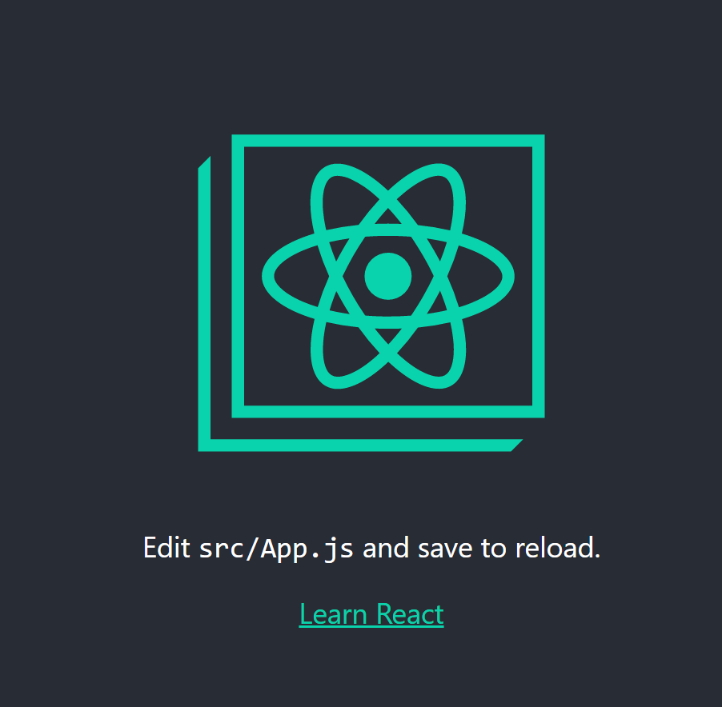

import { Head, Appear, Code, Notes, Image } from 'mdx-deck'
import { Invert, Split , SplitRight } from 'mdx-deck/layouts'
import { CodeSurfer, components } from 'mdx-deck-code-surfer'
import { default as mdxTheme } from 'mdx-deck/themes'
import nightOwl from 'prism-react-renderer/themes/nightOwl'

export const theme = {
  ...mdxTheme,
  codeSurfer: {
    ...nightOwl,
    showNumbers: true
  }
}
export { components } from "mdx-deck-code-surfer"

<Head>
  <title>iCIMS - Building Front-End Applications, Rapidly</title>
</Head>

export default Invert

# Building Front-End Applications, Rapidly
## Parish & Carlos
## iCIMS Labs

---

export default Split


---

## Agenda

- What is React
- Intro to JSX
- Hands on, create-react-app 
- Hands on, create a simple component
- Hands on, using a 3rd party component (Material UI)

<small>Prerecquisits: Javascript, HTML, CSS &amp; Node.js</small>
---

## Objectives and Expectations

- Upon completing this workshop, you will:
  - Have an understanding of React
  - How to create simple React components
  - How to use 3rd party React components
  - Build a simple ToDo app using `create-react-app`

---

export default Invert

## ReactJS

---

## What is React?

- A Javascript library for building user interfaces
- The V in M**V**C
- VirtualDOM
- Component based (components on components on components!)
- Key terms: Components, Props, State

---

## JSX

- Javascript + XML
- HTML with some modifications
  - `className` instead of `class`
  - `children` prop
- Easier to read &amp; write

---
export default Invert

# create-react-app (brought to you by facebook)

- Generates a full react project with a single command
- RAPID development
  - Babel is configured for you
  - No need to configure webpack
  - You get a hot-reloading dev server
  - serious time saver

  `npx create-react-app app-name`

- Open in VS Code
- Execute the dev server with `npm start`

---
# The app will look like this

---
# The project structure will look like this

---
export default Invert

```javascript
import React from 'react';
import logo from './logo.svg';
import './App.css';

function App() {
  return (
    <div className="App">
      <header className="App-header">
        
        <p>
          Edit <code>src/App.js</code> and save to reload.
        </p>
        <a
          className="App-link"
          href="https://reactjs.org"
          target="_blank"
          rel="noopener noreferrer"
        >
          Learn React
        </a>
      </header>
    </div>
  );
}

export default App;
----
* > Open App.js
* > Lets clean out the app so we can write our todo list code here
2:3 > Remove lines 2-3
```

---

export default Invert

```javascript
import React from 'react';

function App() {
  return (
    <div className="App">
      <header className="App-header">
        
        <p>
          Edit <code>src/App.js</code> and save to reload.
        </p>
        <a
          className="App-link"
          href="https://reactjs.org"
          target="_blank"
          rel="noopener noreferrer"
        >
          Learn React
        </a>
      </header>
    </div>
  );
}

export default App;
----
* > Remove lines 2-3
5:20 > Replace line 5-20 with <><p>test</p><>
```
---

export default Invert

```javascript
import React from 'react';

function App() {
  return (
    <>
      <p>test</p>
    </>
  );
}

export default App;
----
* > Your code will look like this
1 > Always import react when using jsx
3 > Prefer stateless functional components over class components
5,7 > An empty tag is a "fragment" a container component that renders nothing to the DOM
6 > We'll render this just to know our app is working
```
---

export default Invert;

# Component Libraries and Material UI

- Benefits of using a component library
  - OOTB HTML elements look bad, Components are built to look great 
  - Component libraries include components that don't exist in HTML

- Check out Material UI (Website Here)
- Install Material UI Core Components and Icons
  - `npm install @material-ui/core`
  - `npm install @material-ui/icons`

---

export default Invert;

# Components We'll use...

- List, ListItem, etc (<a href="https://material-ui.com/components/lists/" target="_blank">Docs</a>)
- Button, IconButton (<a href="https://material-ui.com/components/buttons/" target="_blank">Docs</a>)
- TextField (<a href="https://material-ui.com/components/text-fields/" target="_blank">Docs</a>)
- DeleteIcon (<a href="https://material-ui.com/components/icons/" target="_blank">Docs</a>)
- Grid (<a href="https://material-ui.com/components/grid/" target="_blank">Docs</a>)

---

export default Invert

# Let's build the todo list!

---

export default Invert

```javascript
import React from 'react';
import List from '@material-ui/core/List';
import ListItem from '@material-ui/core/ListItem';
import ListItemText from '@material-ui/core/ListItemText';

function App() {
  return (
    <>
      <p>test</p>
    </>
  );
}

export default App;
----
* > Let's start by adding some todos to our page
2:4 > Import List, ListItem, and ListItemText from material-ui
9 > Replace our placeholder test code with a List of todos
```

---

export default Invert

```javascript
import React from 'react';
import List from '@material-ui/core/List';
import ListItem from '@material-ui/core/ListItem';
import ListItemText from '@material-ui/core/ListItemText';

function App() {
  return (
    <>
      <List>
        <ListItem>
          <ListItemText primary="Todo1" />
        </ListItem>
        <ListItem>
          <ListItemText primary="Todo2" />
        </ListItem>
      </List>
    </>
  );
}

export default App;
----
9:16 > We've added a static list with 2 todo items
9:16 > This is good but we need a way to render todos from data...
```
---

export default Invert

# About React State and Hooks

- State allows your component to "remember" data
- React Hooks are functions that allow us to hook extra behavior into our components
  - [More on React hooks](https://reactjs.org/docs/hooks-state.html)

---
export default Invert

```javascript
import React, { useState } from 'react';
import List from '@material-ui/core/List';
import ListItem from '@material-ui/core/ListItem';
import ListItemText from '@material-ui/core/ListItemText';

function App() {
  const [todos, setTodos] = useState(['test1', 'test2']);

  return (
    <>
      <List>
        {todos.map((todo, index) => (
          <ListItem key={index}>
            <ListItemText primary={todo} />
          </ListItem>
        ))}
      </List>
    </>
  );
}

export default App;
----
1 > We need to import "useState" from react like this
7 > This line adds state to our component
7[4] > "todos" is our state, an array of todo items, stored as strings
7[6] > "setTodos" is a function to set the state to a new value
7[13:18] > "['test1', 'test2']" is the initial value of the todos state
12:16 > We'll loop through all the todos in our state and render a ListItem for each one
12 > .map is used to convert each item in the todo state to a react element
```

---

export default Invert

# Adding new todos

- Without being able to add todos, the app is basically still static...
- Lets add controls for adding new todos to our state
- A React "Ref" is used to access the HTML element rendered by react, we use this to read the value a user enters into a text field

---
export default Invert

```javascript
import React, { useState, useRef } from 'react';
import TextField from '@material-ui/core/TextField';
import Button from '@material-ui/core/Button';
import List from '@material-ui/core/List';
import ListItem from '@material-ui/core/ListItem';
import ListItemText from '@material-ui/core/ListItemText';

function App() {
  const textFieldRef = useRef(null);
  const [todos, setTodos] = useState(['test1', 'test2']);

  // add new todo to state and clear the input
  function handleAddClick() {
    const newTodo = textFieldRef.current.value;
    if(newTodo.length > 0) {
      setTodos([...todos, newTodo]);
      textFieldRef.current.value = '';
    }
  };

  return (
    <>
      <TextField inputRef={textFieldRef} placeholder="new todo" />
      <Button variant="contained" color="primary" onClick={handleAddClick}>Add</Button>
      <List>
        {todos.map((todo, index) => (
          <ListItem key={index}>
            <ListItemText primary={todo} />
          </ListItem>
        ))}
      </List>
    </>
  );
}

export default App;
----
1 > Import useRef from react
2:3 > Import TextField and Button from material-ui
9 > create a ref with useRef. We'll use the ref to get the value of the TextField
12:19 > Create a function to be called when the add button is clicked
14[4:8] > TextFieldRef.current.value will get the current value of our text field
15 > We don't actually update the state if there's no text in the text field
16 > Use "setTodos" to set the todo state. We create a new array that includes the new todo
17 > Clear the text field of its current value
23:24 > Finally we add our TextField and Button
23[3:7] > Setting the inputRef to textFieldRef allows us to access the text field value
23[8:10] > Placeholder text is displayed when our text field is empty
24[3:8] > Setting "variant" and "color" make the button appear solid
24[9:13] > Here we make sure the handleAddClick function is executed when our button is clicked
```

---
export default Invert

# Removing todos

- Lets add a trash button for removing todos 
- Being able to remove todos is useful for marking things completed

---
export default Invert

```javascript
import React, { useState, useRef } from 'react';
import TextField from '@material-ui/core/TextField';
import Button from '@material-ui/core/Button';
import IconButton from '@material-ui/core/IconButton';
import DeleteIcon from '@material-ui/icons/Delete';
import List from '@material-ui/core/List';
import ListItem from '@material-ui/core/ListItem';
import ListItemText from '@material-ui/core/ListItemText';
import ListItemSecondaryAction from '@material-ui/core/ListItemSecondaryAction';

function App() {
  const textFieldRef = useRef(null);
  const [todos, setTodos] = useState(['test1', 'test2']);

  // add new todo to state and clear the input
  function handleAddClick() {
    const newTodo = textFieldRef.current.value;
    if(newTodo.length > 0) {
      setTodos([...todos, newTodo]);
      textFieldRef.current.value = '';
    }
  };

  // update state with deleted todo filtered out
  function handleDeleteClick(index) {
    setTodos(oldTodos => oldTodos.filter((e, i) => i !== index));
  }

  return (
    <>
      <TextField inputRef={textFieldRef} placeholder="new todo" />
      <Button variant="contained" color="primary" onClick={handleAddClick}>Add</Button>
      <List>
        {todos.map((todo, index) => (
          <ListItem key={index}>
            <ListItemText primary={todo} />
            <ListItemSecondaryAction>
              <IconButton onClick={() => handleDeleteClick(index)}>
                <DeleteIcon />
              </IconButton>
            </ListItemSecondaryAction>
          </ListItem>
        ))}
      </List>
    </>
  );
}

export default App;
----
4:5 > Import IconButton and DeleteIcon
9 > Import ListItemSecondaryAction
24:27 > Create a function to remove todo when delete button is clicked
37:41 > Add a ListItemSecondaryAction using the IconButton
```

---
export default Invert

# Responsive Layout

- Let's add a responsive Layout
- We'll use Material-UIs Grid component to make things look much better

---

export default Invert

```javascript
import React, { useState, useRef } from 'react';
import TextField from '@material-ui/core/TextField';
import Button from '@material-ui/core/Button';
import IconButton from '@material-ui/core/IconButton';
import DeleteIcon from '@material-ui/icons/Delete';
import Grid from '@material-ui/core/Grid';
import Typography from '@material-ui/core/Typography';
import List from '@material-ui/core/List';
import ListItem from '@material-ui/core/ListItem';
import ListItemText from '@material-ui/core/ListItemText';
import ListItemSecondaryAction from '@material-ui/core/ListItemSecondaryAction';

function App() {
  const textFieldRef = useRef(null);
  const [todos, setTodos] = useState(['test1', 'test2']);

  // add new todo to state and clear the input
  function handleAddClick() {
    const newTodo = textFieldRef.current.value;
    if(newTodo.length > 0) {
      setTodos([...todos, newTodo]);
      textFieldRef.current.value = '';
    }
  };

  // update state with deleted todo filtered out
  function handleDeleteClick(index) {
    setTodos(oldTodos => oldTodos.filter((e, i) => i !== index));
  }

  return (
    <>
      <Grid container justify="center">
        <Grid item xs={6} md={2}>
          <Typography variant="h3" gutterBottom>Todo List</Typography>
        </Grid>
      </Grid>
      <Grid container justify="center" spacing={3}>
        <Grid item xs={9} md={5}>
          <TextField inputRef={textFieldRef} placeholder="new todo" fullWidth />
        </Grid>
        <Grid item xs={2} md={1}>
          <Button variant="contained" color="primary" onClick={handleAddClick}>Add</Button>
        </Grid>
      </Grid>
      <Grid container justify="center">
        <Grid item xs={12} md={6}>
          <List>
            {todos.map((todo, index) => (
              <ListItem key={index}>
                <ListItemText primary={todo} />
                <ListItemSecondaryAction>
                  <IconButton onClick={() => handleDeleteClick(index)}>
                    <DeleteIcon />
                  </IconButton>
                </ListItemSecondaryAction>
              </ListItem>
            ))}
          </List>
        </Grid>
      </Grid>
    </>
  );
}

export default App;
----
6:7 > Import Grid and Typography
33:37 > Add a cenetered header
33 > Use a container grid to center all content in a grid
34 > Use an item grid for all grid content
34 > Set sizes at different breakpoints using xs and md
35 > Typography will create text elements in material ui style
38:39, 41:42, 44:45 > We want the textfield and button side by side so we'll put them in the same container grid
46:47, 60:61 > Wrap the List with a centered grid, xs={12} and md={6}
```
---

export default Invert

## Desktop


---

export default Invert

## Phone


---

export default Invert

# Take your app further

- Refactoring
  - Make TodoItem its own component
- Ability to edit todos
- Saving todos to a local storage
  - save on add, remove, edit
- Syncing todos to backend
  - Trigger backend sync after any change to local storage
  - Use mocks to develop without a real backend

---
export default Invert

# Thank you!

---
